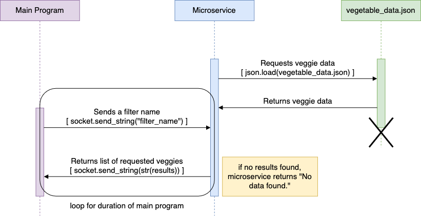

# Vegetable Filtering Microservice
This microservice utilizes a json file of vegetable data to find all vegetables that match a specific category or growing season, as requested by the client.

The communication pipe this microservice uses to send and receive data is ZeroMQ Request-Reply. By default, it is bound as `socket.bind("tcp://*:5555")`. Any code in the following instructions assume the client is using Python.

## HOW TO REQUEST DATA
The two files from this repository required to run the microservice are `server.py` and `vegetable_data.json`. These files should be in the same directory.

Start up the microservice server in a terminal with `python server.py`.

After the client has set up a ZeroMQ socket, to request a list of filtered vegetables, the microservice server should be called in the client by `socket.send_string("filter_name")`, replacing `filter_name` with one of the valid filters listed below. The filter names are not case sensitive.

Valid filter names:

<table><thead>
  <tr>
    <th colspan="4">Categories:</th>
  </tr></thead>
<tbody>
  <tr>
    <td>Root</td>
    <td>Leafy</td>
    <td>Tuber</td>
    <td>Fruit</td>
  </tr>
  <tr>
    <td>Flower</td>
    <td>Legume</td>
    <td>Bulb</td>
    <td>Grain</td>
  </tr>
  <tr>
    <td>Stem</td>
    <td>Herb</td>
    <td>Cactus</td>
    <td>Succulent</td>
  </tr>
  <tr>
    <td>Fern</td>
    <td></td>
    <td></td>
    <td></td>
  </tr>
<thead>
  <tr>
    <th colspan="4">Seasons:</th>
  </tr></thead>
  <tr>
    <td>Spring</td>
    <td>Summer</td>
    <td>Fall</td>
    <td>Winter</td>
  </tr>
</tbody>
</table>

## HOW TO RECEIVE DATA
Once the client has requested a list of filtered vegetables using the process above, to receive the data from the server, use `message = socket.recv()` (where `message` can be any desired variable name). 

The data will then need to be decoded into a string value with `message.decode()`.

## UML Sequence Diagram

## Dataset credit
Original Vegetables Dataset by Rudra Prasad Bhuyan:
> https://www.kaggle.com/datasets/rudraprasadbhuyan/vegetables-dataset

Dataset was modified for use with this microservice. Original dataset and code used is in the `dataset` directory.